# 地下城适配器系统架构总览

## 1. 系统架构总览

```mermaid
graph TB
    subgraph "用户界面层"
        CLI[命令行接口<br/>src/cli.py]
        API[API接口<br/>未来扩展]
    end
    
    subgraph "核心管理层"
        AM[适配器管理器<br/>src/adapter_manager.py]
        QA[质量评估器<br/>src/quality_assessor.py]
        VI[可视化器<br/>src/visualizer.py]
    end
    
    subgraph "数据转换层"
        subgraph "适配器插件"
            WA[Watabou适配器<br/>watabou_adapter.py]
            DA[Donjon适配器<br/>donjon_adapter.py]
            DDA[DungeonDraft适配器<br/>dungeondraft_adapter.py]
            DD2VTT[DD2VTT适配器<br/>dd2vtt_adapter.py]
            FEA[FiMap Elites适配器<br/>fimap_elites_adapter.py]
        end
        
        SI[空间推理引擎<br/>src/spatial_inference.py]
        SC[数据模式<br/>src/schema.py]
    end
    
    subgraph "质量评估层"
        subgraph "评估规则插件"
            AR[可访问性规则<br/>accessibility.py]
            DVR[度方差规则<br/>degree_variance.py]
            DDR[门分布规则<br/>door_distribution.py]
            DER[死胡同比例规则<br/>dead_end_ratio.py]
            KPLR[关键路径长度规则<br/>key_path_length.py]
            LRR[环路比例规则<br/>loop_ratio.py]
            PDR[路径多样性规则<br/>path_diversity.py]
            TMDR[宝藏怪物分布规则<br/>treasure_monster_distribution.py]
            ABR[美学平衡规则<br/>aesthetic_balance.py]
        end
    end
    
    subgraph "数据层"
        UDF[统一地下城格式<br/>UnifiedDungeonFormat]
        JSON[各种源格式<br/>JSON文件]
    end
    
    CLI --> AM
    CLI --> QA
    CLI --> VI
    
    AM --> WA
    AM --> DA
    AM --> DDA
    AM --> DD2VTT
    AM --> FEA
    
    AM --> SI
    AM --> SC
    
    QA --> AR
    QA --> DVR
    QA --> DDR
    QA --> DER
    QA --> KPLR
    QA --> LRR
    QA --> PDR
    QA --> TMDR
    QA --> ABR
    
    WA --> UDF
    DA --> UDF
    DDA --> UDF
    DD2VTT --> UDF
    FEA --> UDF
    
    SI --> UDF
    SC --> UDF
    
    AR --> UDF
    DVR --> UDF
    DDR --> UDF
    DER --> UDF
    KPLR --> UDF
    LRR --> UDF
    PDR --> UDF
    TMDR --> UDF
    ABR --> UDF
    
    JSON --> WA
    JSON --> DA
    JSON --> DDA
    JSON --> DD2VTT
    JSON --> FEA
```



## 2. 插件适配器架构

```mermaid
graph TB
    subgraph "适配器管理器 (AdapterManager)"
        DM[动态加载器<br/>_load_adapters()]
        DF[格式检测器<br/>detect_format()]
        CV[转换器<br/>convert()]
    end
    
    subgraph "适配器基类 (BaseAdapter)"
        BA[抽象基类]
        FN[format_name属性]
        DT[detect方法]
        CN[convert方法]
        CI[convert_with_inference方法]
    end
    
    subgraph "具体适配器实现"
        WA[WatabouAdapter<br/>watabou_adapter.py]
        DA[DonjonAdapter<br/>donjon_adapter.py]
        DDA[DungeonDraftAdapter<br/>dungeondraft_adapter.py]
        DD2VTT[DD2VTTAdapter<br/>dd2vtt_adapter.py]
        FEA[FiMapElitesAdapter<br/>fimap_elites_adapter.py]
    end
    
    subgraph "统一数据格式"
        UDF[UnifiedDungeonFormat]
        HD[Header信息]
        LV[Levels数据]
        RM[Rooms数据]
        CN[Connections数据]
        CR[Corridors数据]
    end
    
    DM --> BA
    DF --> BA
    CV --> BA
    
    BA --> WA
    BA --> DA
    BA --> DDA
    BA --> DD2VTT
    BA --> FEA
    
    WA --> UDF
    DA --> UDF
    DDA --> UDF
    DD2VTT --> UDF
    FEA --> UDF
    
    UDF --> HD
    UDF --> LV
    LV --> RM
    LV --> CN
    LV --> CR
```

## 3. 空间推理与图模型流程

```mermaid
graph TB
    subgraph "输入数据"
        DD[地下城数据<br/>DungeonData]
        RM[房间列表<br/>Rooms]
        CR[走廊列表<br/>Corridors]
        CN[连接信息<br/>Connections]
    end
    
    subgraph "空间推理引擎 (SpatialInferenceEngine)"
        RB[房间边界提取<br/>_get_room_bounds()]
        AD[邻接判断<br/>_are_rooms_adjacent()]
        CF[置信度计算<br/>_calculate_adjacency_confidence()]
        DP[门位置推断<br/>_infer_door_position()]
    end
    
    subgraph "图模型构建"
        GR[连接图构建<br/>Graph Construction]
        TP[拓扑分析<br/>Topology Analysis]
        SP[最短路径<br/>Shortest Path]
        CC[连通分量<br/>Connected Components]
    end
    
    subgraph "入口出口识别"
        SE[语义分析<br/>_analyze_room_semantics()]
        TR[拓扑规则<br/>Topology Rules]
        SP2[空间位置<br/>Spatial Position]
        ID[智能识别<br/>identify_entrance_exit()]
    end
    
    subgraph "输出增强数据"
        ED[增强数据<br/>Enhanced Data]
        IC[推断连接<br/>Inferred Connections]
        ID2[推断门<br/>Inferred Doors]
        IE[入口出口<br/>Entrance/Exit]
    end
    
    DD --> RB
    RM --> RB
    CR --> RB
    
    RB --> AD
    AD --> CF
    AD --> DP
    
    CF --> GR
    DP --> GR
    
    GR --> TP
    GR --> SP
    GR --> CC
    
    TP --> SE
    SP --> TR
    CC --> SP2
    
    SE --> ID
    TR --> ID
    SP2 --> ID
    
    ID --> ED
    CF --> IC
    DP --> ID2
    ID --> IE
    
    IC --> ED
    ID2 --> ED
    IE --> ED
```

## 4. 指标计算管道

```mermaid
graph TB
    subgraph "输入数据"
        UDF[统一地下城格式<br/>UnifiedDungeonFormat]
        SI[空间推理结果<br/>Spatial Inference]
    end
    
    subgraph "质量评估器 (DungeonQualityAssessor)"
        LR[规则加载器<br/>_load_rules()]
        RW[权重配置<br/>rule_weights]
        AQ[质量评估<br/>assess_quality()]
    end
    
    subgraph "评估规则管道"
        subgraph "结构规则 (35%)"
            AR[可访问性规则<br/>AccessibilityRule]
            DVR[度方差规则<br/>DegreeVarianceRule]
            DDR[门分布规则<br/>DoorDistributionRule]
            LRR[环路比例规则<br/>LoopRatioRule]
        end
        
        subgraph "游戏性规则 (50%)"
            PDR[路径多样性规则<br/>PathDiversityRule]
            TMDR[宝藏怪物分布规则<br/>TreasureMonsterDistributionRule]
            DER[死胡同比例规则<br/>DeadEndRatioRule]
        end
        
        subgraph "美学规则 (15%)"
            ABR[美学平衡规则<br/>AestheticBalanceRule]
        end
    end
    
    subgraph "评分计算"
        WS[加权求和<br/>Weighted Sum]
        CS[分类评分<br/>Category Scores]
        OS[总体评分<br/>Overall Score]
        GR[等级评定<br/>Grade]
    end
    
    subgraph "输出结果"
        DR[详细报告<br/>Detailed Report]
        RC[改进建议<br/>Recommendations]
        JS[JSON输出<br/>JSON Output]
    end
    
    UDF --> AQ
    SI --> AQ
    
    AQ --> AR
    AQ --> DVR
    AQ --> DDR
    AQ --> LRR
    AQ --> PDR
    AQ --> TMDR
    AQ --> DER
    AQ --> ABR
    
    AR --> WS
    DVR --> WS
    DDR --> WS
    LRR --> WS
    PDR --> WS
    TMDR --> WS
    DER --> WS
    ABR --> WS
    
    WS --> CS
    CS --> OS
    OS --> GR
    
    OS --> DR
    CS --> RC
    DR --> JS
    RC --> JS
    GR --> JS
```

## 5. 系统核心组件说明

### 5.1 适配器管理器 (AdapterManager)
- **功能**: 动态加载和管理各种格式的适配器插件
- **核心方法**: 
  - `_load_adapters()`: 动态加载适配器
  - `detect_format()`: 自动检测数据格式
  - `convert()`: 执行数据转换

### 5.2 空间推理引擎 (SpatialInferenceEngine)
- **功能**: 基于房间位置和尺寸自动推断连接关系
- **核心算法**:
  - 边界提取和邻接判断
  - 置信度计算
  - 门位置推断
  - 连接图构建

### 5.3 质量评估器 (DungeonQualityAssessor)
- **功能**: 多维度评估地下城设计质量
- **评估维度**:
  - 结构规则 (35%): 可访问性、度方差、门分布、环路比例
  - 游戏性规则 (50%): 路径多样性、宝藏怪物分布、死胡同比例
  - 美学规则 (15%): 美学平衡

### 5.4 统一数据格式 (UnifiedDungeonFormat)
- **功能**: 标准化的地下城数据表示
- **结构**:
  - Header: 元数据信息
  - Levels: 层级数据
  - Rooms: 房间信息
  - Connections: 连接关系
  - Corridors: 走廊信息

## 6. 扩展性设计

### 6.1 插件化架构
- 适配器插件: 支持新的地下城生成器格式
- 评估规则插件: 支持新的质量评估指标
- 可视化插件: 支持新的可视化方式

### 6.2 配置化权重
- 评估规则权重可配置
- 空间推理阈值可调整
- 支持自定义评估标准

### 6.3 模块化设计
- 各组件独立，松耦合
- 支持单独使用和组合使用
- 便于测试和维护 